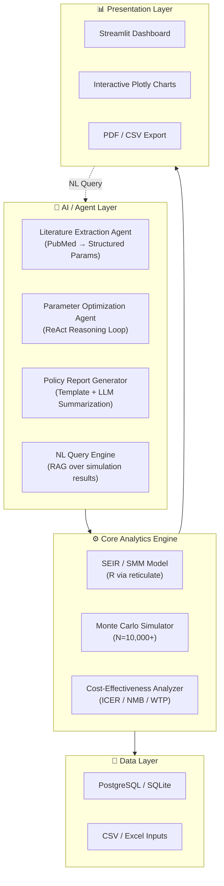

# 🦠 AI-Powered Influenza Antiviral Stockpile Dashboard

> An **AI-enhanced decision support system** for scenario analysis of influenza antiviral (Baloxavir vs Oseltamivir) stockpile strategies, based on Hong Kong pandemic model outputs. Built with Streamlit + LLM Agent workflow.


---

## 🌟 AI-Powered Features

This dashboard integrates **LLM Agent capabilities** to automate and enhance public health decision-making:

- **🤖 LLM-Assisted Parameter Extraction** — Automatically extract key epidemiological parameters (VE, serial interval, R0) from PubMed literature and WHO guidelines using structured prompting
- **🧠 Intelligent Scenario Optimization** — AI-driven agent searches the parameter space for cost-optimal stockpile strategies using ReAct reasoning loops
- **📊 Natural Language Query Interface** — Query simulation results using plain English (e.g., *"What is the ICER when BXM covers 30% of the population?"*)
- **📄 Automated Policy Brief Generation** — One-click PDF report generation with AI-summarized key findings, sensitivity analysis highlights, and actionable policy recommendations
- **🔍 Anomaly Detection in Simulations** — AI detects outliers in Monte Carlo outputs and performs automatic root cause analysis

---

## 🏗️ System Architecture



---

## 📋 Features Overview

| Category | Feature | Description |
|----------|---------|-------------|
| **Scenario Analysis** | Multi-scenario comparison | Compare BXM vs OTV across dozens of stockpile strategies |
| **Cost-Effectiveness** | ICER / NMB / CEAC | Full health economics evaluation with WTP threshold analysis |
| **Visualization** | Interactive charts | Heatmaps, bubble charts, cost-effectiveness planes, tornado diagrams |
| **AI-Enhanced** | Literature extraction | LLM-powered parameter extraction from scientific literature |
| **AI-Enhanced** | Smart optimization | Agent-driven parameter space search for optimal strategies |
| **AI-Enhanced** | Report generation | Automated PDF policy briefs with AI summaries |
| **Data Pipeline** | End-to-end ETL | Data ingestion → cleaning → storage → visualization |
| **Export** | Multiple formats | CSV, PDF, interactive HTML reports |

---

## 🚀 Quick Start

### Prerequisites

- Python 3.11+
- [Streamlit](https://streamlit.io/) >= 1.30
- An LLM API key (OpenAI / Claude / MiMo / DeepSeek) for AI features

### Installation

```bash
# Clone the repository
git clone https://github.com/RuohanCHEN01/Dashboard_Baloxavir_HK_Stockpile.git
cd Dashboard_Baloxavir_HK_Stockpile

# Create and activate virtual environment
python -m venv venv
source venv/bin/activate  # or venv\Scripts\activate on Windows

# Install dependencies
pip install -r requirements.txt

# (Optional) Configure LLM API for AI features
cp .env.example .env
# Edit .env with your API keys
```

### Run the Dashboard

```bash
streamlit run app.py
```

Navigate to `http://localhost:8501` to access the dashboard.

---

## 📁 Project Structure

```
Dashboard_Baloxavir_HK_Stockpile/
├── ai_agent/                      # 🤖 AI/LLM Agent module (NEW)
│   ├── __init__.py               # Module exports
│   ├── llm_interface.py          # Multi-provider LLM client
│   ├── literature_extractor.py   # PubMed evidence extraction
│   ├── report_generator.py       # AI policy brief generator
│   ├── nl_query.py               # Natural language query engine
│   ├── config.py                 # AI module configuration
│   └── prompts/                  # Prompt templates (YAML)
│       ├── system_prompts.yaml
│       └── extraction_prompts.yaml
├── dashboard_app/                # Core Streamlit application
│   ├── config.py                 # Dashboard settings
│   └── requirements.txt          # App-specific dependencies
├── utils/                        # Utility modules
│   ├── data_processor.py         # Data cleaning & transformation
│   └── visualizer.py             # Chart generators (Plotly/Matplotlib)
├── Raw_Code_Data/                # Original R/Python analysis code
│   ├── INMB_calculate.py
│   ├── cost_effective.py
│   └── Resistance_stockpile_FCFS_R13_Feb2026_Vaccine_output_tocalculate_CEA.py
├── docs/                         # 📚 Documentation (NEW)
│   ├── user_guide.md
│   ├── ai_module_guide.md
│   └── architecture.md
├── .github/workflows/            # CI/CD (NEW)
│   └── ci.yml
├── tests/                        # Test suite (NEW)
│   ├── test_data_processor.py
│   └── test_ai_agent.py
├── app.py                        # Main entry point
├── requirements.txt              # Python dependencies
├── .env.example                  # Environment variable template
├── .gitignore                    # Git ignore rules
└── README.md                     # This file
```

---

## 🤖 AI Module Documentation

The `ai_agent/` module provides a unified interface to multiple LLM providers:

```python
from ai_agent import LLMClient, LiteratureExtractor

# Initialize with any supported provider
client = LLMClient(provider="mimo", model="MiMo-V2.5-Pro")

# Extract epidemiological parameters from a PubMed abstract
extractor = LiteratureExtractor(client)
params = extractor.extract("Background: Influenza vaccine effectiveness was estimated at 42%...")
# Returns: {"vaccine_efficacy": 0.42, "confidence": "high", ...}
```

### Supported LLM Providers

| Provider | Models | Context Window | Multi-Modal |
|----------|--------|---------------|-------------|
| OpenAI | GPT-4o, GPT-4-turbo | 128K | ✅ |
| Anthropic | Claude 3.5 Sonnet | 200K | ✅ |
| **MiMo** | **V2.5-Pro, V2.5** | **1M** | ✅ |
| DeepSeek | V3, R1 | 64K | ❌ |

---

## 🗺️ Roadmap

- [x] ~~Core Dashboard~~ — Streamlit-based scenario analysis
- [x] ~~Cost-Effectiveness Engine~~ — ICER/NMB calculations
- [x] ~~Data Visualization~~ — Plotly interactive charts
- [x] **AI Agent Module** — LLM-powered analysis features *(v2.0)*
- [x] **CI/CD Pipeline** — GitHub Actions automated testing
- [ ] **Streamlit Cloud Deployment** — Public online demo
- [ ] **Natural Language Query** — Ask questions about results in plain language
- [ ] **Automated Report Generation** — One-click PDF policy briefs
- [ ] **Docker Containerization** — One-command deployment
- [ ] **Multi-region Support** — Extend beyond Hong Kong model

---

## 🧪 Testing

```bash
# Run all tests
python -m pytest tests/ -v

# Run with coverage
python -m pytest tests/ --cov=ai_agent --cov=utils --cov-report=term-missing
```

---

## 📄 License

This project is licensed under the MIT License. See the [LICENSE](LICENSE) file for details.

---

## 👤 Author

**Ruohan Chen** (陈若涵) — PhD Candidate in Epidemiology & Biostatistics

- 🏫 The University of Hong Kong (HKU), School of Public Health
- 🌐 WHO Collaborating Centre for Infectious Disease Epidemiology and Control
- 📧 [ruohan0@connect.hku.hk](mailto:ruohan0@connect.hku.hk)
- 🔬 [ResearchGate](https://www.researchgate.net/profile/Ruohan-Chen-4) | [GitHub](https://github.com/RuohanCHEN01)

---

## 🙏 Acknowledgements

- Supervisor: Prof. Benjamin Cowling & Dr. Z. Du (HKU SPH)
- WHO Collaborating Centre for Infectious Disease Epidemiology and Control
- Hong Kong pandemic modeling research group
